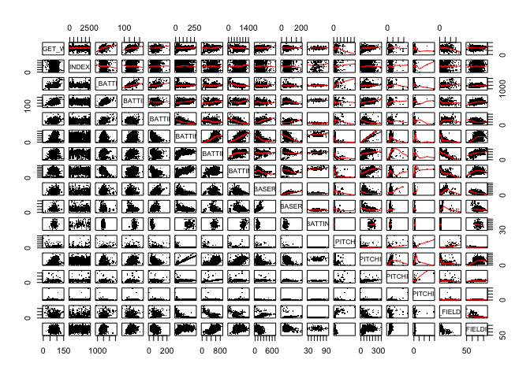
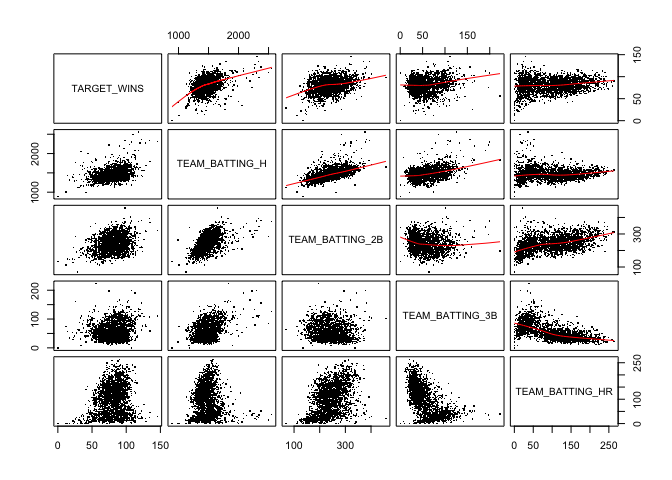
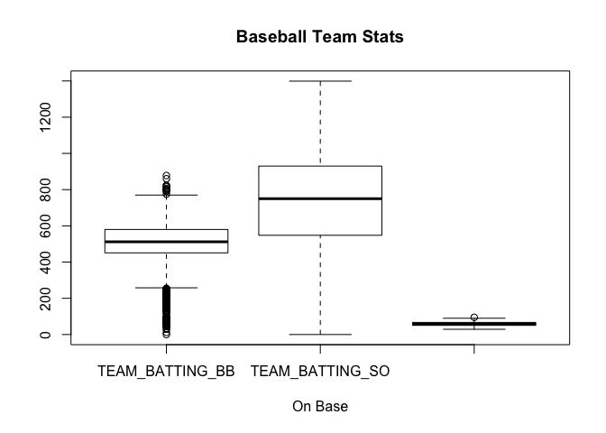
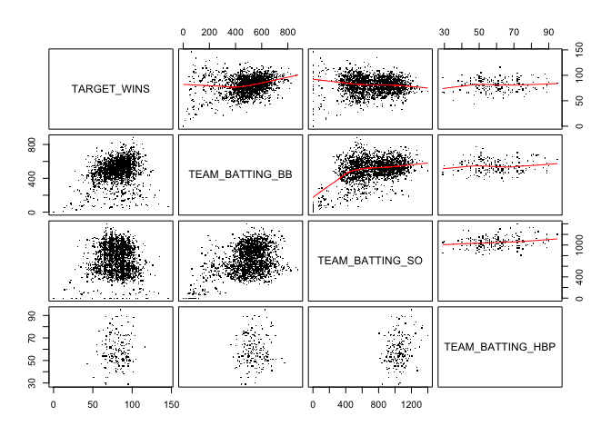
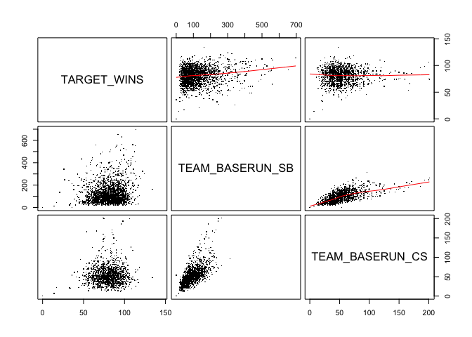
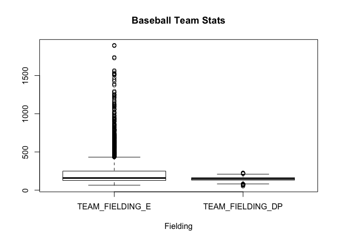
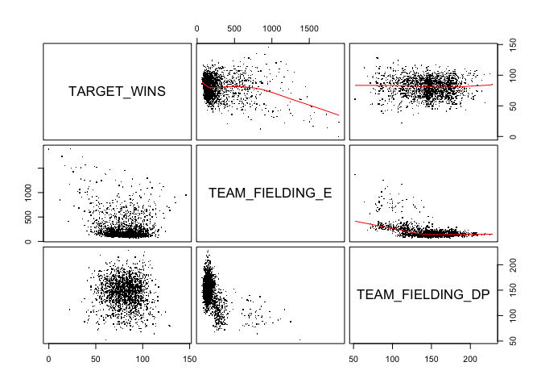
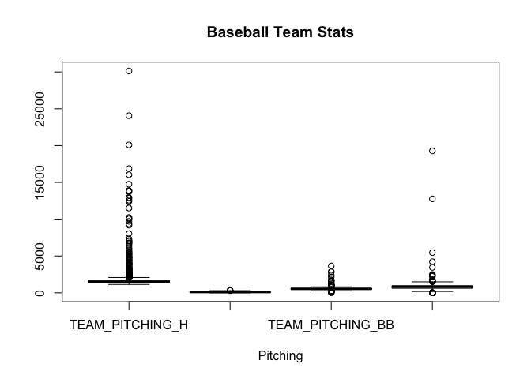
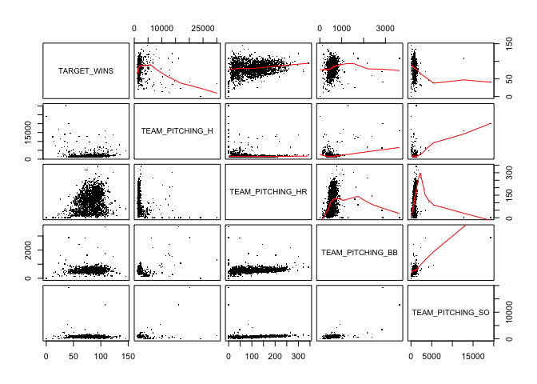

# Moneyball Multiple Regression Model


# Data Dictionary

variable            | definition                              | effect
----------------    | -----------                             |------------
`INDEX`             | Identification Variable (do not use)    | None
`TARGET_WINS`       | Number of wins                          | Positive
`TEAM_BATTING_H`    | Base Hits by batters (1B,2B,3B,HR)      | Positive
`TEAM_BATTING_2B`   | Doubles by batters (2B)                 | Positive
`TEAM_BATTING_3B`   | Triples by batters (3B)                 | Positive
`TEAM_BATTING_HR`   | Homeruns by batters (4B)                | Positive
`TEAM_BATTING_BB`   | Walks by batters                        | Positive
`TEAM_BATTING_SO`   | Strikeouts by batters                   | Negative
`TEAM_BATTING_HBP`  | Batters hit by pitch (get a free base)  | Positive
`TEAM_BASERUN_SB`   | Stolen bases                            | Positive
`TEAM_BASERUN_CS`   | Caught stealing                         | Negative
`TEAM_PITCHING_H`   | Hits allowed                            | Negative
`TEAM_PITCHING_HR`  | Homeruns allowed                        | Negative
`TEAM_PITCHING_BB`  | Walks allowed                           | Negative
`TEAM_PITCHING_SO`  | Strikeouts by pitchers                  | Positive
`TEAM_FIELDING_E`   | Errors                                  | Negative
`TEAM_FIELDING_DP`  | Double Plays                            | Positive
----------------    | -----------                             |------------

# Exploring the data

Many of the statistics in the data sets provided have been extrapolated using base statistics from the deadball 
era circa ~1900-1920 and prior.  Outliers that need to be adjusted can be found using the reference link [!baseball-almanac](http://www.baseball-almanac.com/recbooks/rb_stba2.shtml).  Note that during the deadball
era, a nearly soft ball was used which had dramatic effect on power hitting and pitching statistics.
Any adjustment that rationalize the data from this period into observations that include post WWII statistics
should be bound by the later era's limits so distributions aren't skewed.


Generalized Equation for Multiple Regression
\[
\begin{aligned}
\widehat{wins} &= \hat{\beta}_0 + 
                    \hat{\beta}_1 \times hits  + 
                    \hat{\beta}_2 \times doubles + 
                    \hat{\beta}_3 \times triples +
                    \hat{\beta}_4 \times homeruns + 
                    \hat{\beta}_5 \times walks + 
                    \hat{\beta}_6 \times strikeouts . . . +
                    \end{aligned}
\]

## Full Panel

```r
#wins x full panel
pairs(TARGET_WINS~.,
        data=BB.df,pch=".",gap=.5,upper.panel=panel.smooth)
```



```r
ml.full <- lm(TARGET_WINS~.
                  , data = BB.df)
summary(ml.full)
```

```
## 
## Call:
## lm(formula = TARGET_WINS ~ ., data = BB.df)
## 
## Residuals:
##      Min       1Q   Median       3Q      Max 
## -20.0626  -5.4196  -0.0423   5.2111  22.9355 
## 
## Coefficients:
##                    Estimate Std. Error t value Pr(>|t|)    
## (Intercept)      60.4562317 19.7385030   3.063  0.00254 ** 
## INDEX            -0.0002478  0.0008508  -0.291  0.77122    
## TEAM_BATTING_H    1.8111103  2.7908648   0.649  0.51723    
## TEAM_BATTING_2B   0.0267462  0.0303941   0.880  0.38008    
## TEAM_BATTING_3B  -0.1018043  0.0777401  -1.310  0.19208    
## TEAM_BATTING_HR  -4.6100155 10.5666083  -0.436  0.66317    
## TEAM_BATTING_BB  -4.4606275  3.6457882  -1.224  0.22279    
## TEAM_BATTING_SO   0.4303282  2.6231874   0.164  0.86988    
## TEAM_BASERUN_SB   0.0335937  0.0288100   1.166  0.24519    
## TEAM_BASERUN_CS  -0.0130338  0.0719436  -0.181  0.85645    
## TEAM_BATTING_HBP  0.0837038  0.0499097   1.677  0.09532 .  
## TEAM_PITCHING_H  -1.7887761  2.7903398  -0.641  0.52233    
## TEAM_PITCHING_HR  4.6958245 10.5649821   0.444  0.65725    
## TEAM_PITCHING_BB  4.5120283  3.6432611   1.238  0.21721    
## TEAM_PITCHING_SO -0.4618971  2.6214432  -0.176  0.86034    
## TEAM_FIELDING_E  -0.1724513  0.0415365  -4.152 5.16e-05 ***
## TEAM_FIELDING_DP -0.1063200  0.0371964  -2.858  0.00478 ** 
## ---
## Signif. codes:  0 '***' 0.001 '**' 0.01 '*' 0.05 '.' 0.1 ' ' 1
## 
## Residual standard error: 8.489 on 174 degrees of freedom
##   (2085 observations deleted due to missingness)
## Multiple R-squared:  0.5503,	Adjusted R-squared:  0.509 
## F-statistic: 13.31 on 16 and 174 DF,  p-value: < 2.2e-16
```

## Slugging
The most hits in a single season (unadjusted) is 1783--NL Philadelphia Phillies 1930.
The most doubles in a single season (unadjusted) is 376--AL Texas in 2008.
The most triples in a single season (unadjusted) is 153--NL Baltimore in 1894.
Records that exceed these amounts should be adjusted either to NA or the median.


```r
kable(DescStats.df[,2:6],align='l',digits = c(0,2,2))
```

              TARGET_WINS   TEAM_BATTING_H   TEAM_BATTING_2B   TEAM_BATTING_3B   TEAM_BATTING_HR 
------------  ------------  ---------------  ----------------  ----------------  ----------------
nobs          2276          2276.00          2276.00           2276              2276.00         
NAs           0             0.00             0.00              0                 0.00            
Minimum       0             891.00           69.00             0                 0.00            
Maximum       146           2554.00          458.00            223               264.00          
1. Quartile   71            1383.00          208.00            34                42.00           
3. Quartile   92            1537.25          273.00            72                147.00          
Mean          81            1469.27          241.25            55                99.61           
Median        82            1454.00          238.00            47                102.00          
Sum           183880        3344058.00       549078.00         125749            226717.00       
SE Mean       0             3.03             0.98              1                 1.27            
LCL Mean      80            1463.33          239.32            54                97.12           
UCL Mean      81            1475.21          243.17            56                102.10          
Variance      248           20906.61         2190.37           781               3665.92         
Stdev         16            144.59           46.80             28                60.55           
Skewness      0             1.57             0.22              1                 0.19            
Kurtosis      1             7.28             0.01              2                 -0.96           


```r
# wins x batting - slugging
pairs(TARGET_WINS ~ TEAM_BATTING_H + TEAM_BATTING_2B + TEAM_BATTING_3B + TEAM_BATTING_HR, 
    data = BB.df, pch = ".", gap = 0.5, upper.panel = panel.smooth)
```



```r
ml.slugging <- lm(TARGET_WINS ~ TEAM_BATTING_H + TEAM_BATTING_2B + TEAM_BATTING_3B + 
    TEAM_BATTING_HR, data = BB.df)
summary(ml.slugging)
```

```
## 
## Call:
## lm(formula = TARGET_WINS ~ TEAM_BATTING_H + TEAM_BATTING_2B + 
##     TEAM_BATTING_3B + TEAM_BATTING_HR, data = BB.df)
## 
## Residuals:
##     Min      1Q  Median      3Q     Max 
## -71.255  -8.903   0.598   9.569  50.410 
## 
## Coefficients:
##                  Estimate Std. Error t value Pr(>|t|)    
## (Intercept)     18.435900   3.180376   5.797 7.70e-09 ***
## TEAM_BATTING_H   0.031581   0.003082  10.247  < 2e-16 ***
## TEAM_BATTING_2B  0.004840   0.009118   0.531    0.596    
## TEAM_BATTING_3B  0.122356   0.016571   7.384 2.15e-13 ***
## TEAM_BATTING_HR  0.080577   0.007219  11.162  < 2e-16 ***
## ---
## Signif. codes:  0 '***' 0.001 '**' 0.01 '*' 0.05 '.' 0.1 ' ' 1
## 
## Residual standard error: 14.08 on 2271 degrees of freedom
## Multiple R-squared:  0.2024,	Adjusted R-squared:  0.201 
## F-statistic:   144 on 4 and 2271 DF,  p-value: < 2.2e-16
```

## On-Base
102 strikeout NAs can remain as long as they're not counted in descriptive statistics 
as observations.  2085 hit by pitch NAs disqualifies this field from use in the model.

The most walks in a single season (unadjusted) is 835--AL Boston Red Sox in 1949.
The fewest walks in a single season (unadjusted) is 282--NL St. Louis Cardinals 1908.
Records that exceed these amounts should be adjusted either to NA or the median.


```r
kable(DescStats.df[,c(7,8,11)],align='l',digits = c(0,2,2))
```

              TEAM_BATTING_BB   TEAM_BATTING_SO   TEAM_BATTING_HBP 
------------  ----------------  ----------------  -----------------
nobs          2276              2276.00           2276.00          
NAs           0                 102.00            2085.00          
Minimum       0                 0.00              29.00            
Maximum       878               1399.00           95.00            
1. Quartile   451               548.00            50.50            
3. Quartile   580               930.00            67.00            
Mean          502               735.61            59.36            
Median        512               750.00            58.00            
Sum           1141548           1599206.00        11337.00         
SE Mean       3                 5.33              0.94             
LCL Mean      497               725.15            57.51            
UCL Mean      507               746.06            61.21            
Variance      15048             61765.38          168.15           
Stdev         123               248.53            12.97            
Skewness      -1                -0.30             0.32             
Kurtosis      2                 -0.32             -0.11            


```r
boxplot(BB.df[,c(7,8,11)],main="Baseball Team Stats", 
        	xlab="On Base") 
```




```r
# wins x batting - on-base
pairs(TARGET_WINS ~ TEAM_BATTING_BB + TEAM_BATTING_SO + TEAM_BATTING_HBP, data = BB.df, 
    pch = ".", gap = 0.5, upper.panel = panel.smooth)
```



```r
ml.onbase <- lm(TARGET_WINS ~ TEAM_BATTING_BB + TEAM_BATTING_SO + TEAM_BATTING_HBP, 
    data = BB.df)
summary(ml.onbase)
```

```
## 
## Call:
## lm(formula = TARGET_WINS ~ TEAM_BATTING_BB + TEAM_BATTING_SO + 
##     TEAM_BATTING_HBP, data = BB.df)
## 
## Residuals:
##      Min       1Q   Median       3Q      Max 
## -25.4674  -6.9172  -0.9165   6.0289  29.4135 
## 
## Coefficients:
##                   Estimate Std. Error t value Pr(>|t|)    
## (Intercept)      71.816799   8.306363   8.646 2.38e-15 ***
## TEAM_BATTING_BB   0.088179   0.009771   9.025  < 2e-16 ***
## TEAM_BATTING_SO  -0.043822   0.007191  -6.094 6.14e-09 ***
## TEAM_BATTING_HBP  0.122290   0.056428   2.167   0.0315 *  
## ---
## Signif. codes:  0 '***' 0.001 '**' 0.01 '*' 0.05 '.' 0.1 ' ' 1
## 
## Residual standard error: 9.837 on 187 degrees of freedom
##   (2085 observations deleted due to missingness)
## Multiple R-squared:  0.3512,	Adjusted R-squared:  0.3408 
## F-statistic: 33.74 on 3 and 187 DF,  p-value: < 2.2e-16
```

## Base Running
131 stolen base NAs can & 772 caught stealing NAs can remain as long as they're not counted
in descriptive statistics.

The most stolen bases in a single season (unadjusted) is 426--NL New York in 1893.
The most caught stealing bases count in a single season (unadjusted) is 191--AL NY in 1914.
Records that exceed these amounts should be adjusted either to NA or the median.

These statistics are co-linear and may be better used as a derived statistic for
Expected value of team stolen bases E(SB) = SB * likelihood of success (SB/SB attempts)


```r
kable(DescStats.df[,9:10],align='l',digits = c(0,2,2))
```

              TEAM_BASERUN_SB   TEAM_BASERUN_CS 
------------  ----------------  ----------------
nobs          2276              2276.00         
NAs           131               772.00          
Minimum       0                 0.00            
Maximum       697               201.00          
1. Quartile   66                38.00           
3. Quartile   156               62.00           
Mean          125               52.80           
Median        101               49.00           
Sum           267614            79417.00        
SE Mean       2                 0.59            
LCL Mean      121               51.64           
UCL Mean      128               53.96           
Variance      7707              526.99          
Stdev         88                22.96           
Skewness      2                 1.98            
Kurtosis      5                 7.62            


```r
# wins x batting - base running
pairs(TARGET_WINS ~ TEAM_BASERUN_SB + TEAM_BASERUN_CS, data = BB.df, pch = ".", 
    gap = 0.5, upper.panel = panel.smooth)
```



```r
ml.baserunning <- lm(TARGET_WINS ~ TEAM_BASERUN_SB + TEAM_BASERUN_CS, data = BB.df)
summary(ml.baserunning)
```

```
## 
## Call:
## lm(formula = TARGET_WINS ~ TEAM_BASERUN_SB + TEAM_BASERUN_CS, 
##     data = BB.df)
## 
## Residuals:
##     Min      1Q  Median      3Q     Max 
## -78.059  -8.592   0.387   8.972  47.879 
## 
## Coefficients:
##                 Estimate Std. Error t value Pr(>|t|)    
## (Intercept)     78.05949    0.90351  86.396  < 2e-16 ***
## TEAM_BASERUN_SB  0.07365    0.01013   7.268 5.86e-13 ***
## TEAM_BASERUN_CS -0.08063    0.01969  -4.095 4.45e-05 ***
## ---
## Signif. codes:  0 '***' 0.001 '**' 0.01 '*' 0.05 '.' 0.1 ' ' 1
## 
## Residual standard error: 13.24 on 1501 degrees of freedom
##   (772 observations deleted due to missingness)
## Multiple R-squared:  0.03448,	Adjusted R-squared:  0.03319 
## F-statistic:  26.8 on 2 and 1501 DF,  p-value: 3.667e-12
```

## Fielding
286 Fielding error NAs can remain as long as they're not counted in descriptive statistics 
as observations.  

The most fielding errors in a single season (unadjusted) is 639--NL Philadelphia in 1883.
The most fielding errors in a single season (unadjusted) post WWII is 234--NL Philadelphia in 1945.
Records that exceed the post WWII amount should be adjusted either to NA or the median.


```r
kable(DescStats.df[,16:17],align='l',digits = c(0,2,2))
```

              TEAM_FIELDING_E   TEAM_FIELDING_DP 
------------  ----------------  -----------------
nobs          2276              2276.00          
NAs           0                 286.00           
Minimum       65                52.00            
Maximum       1898              228.00           
1. Quartile   127               131.00           
3. Quartile   249               164.00           
Mean          246               146.39           
Median        159               149.00           
Sum           560990            291312.00        
SE Mean       5                 0.59             
LCL Mean      237               145.23           
UCL Mean      256               147.54           
Variance      51880             687.82           
Stdev         228               26.23            
Skewness      3                 -0.39            
Kurtosis      11                0.18             


```r
boxplot(BB.df[,16:17],main="Baseball Team Stats", 
        	xlab="Fielding") 
```




```r
# wins x batting - base running
pairs(TARGET_WINS ~ TEAM_FIELDING_E + TEAM_FIELDING_DP, data = BB.df, pch = ".", 
    gap = 0.5, upper.panel = panel.smooth)
```



```r
ml.fielding <- lm(TARGET_WINS ~ TEAM_FIELDING_E + TEAM_FIELDING_DP, data = BB.df)
summary(ml.fielding)
```

```
## 
## Call:
## lm(formula = TARGET_WINS ~ TEAM_FIELDING_E + TEAM_FIELDING_DP, 
##     data = BB.df)
## 
## Residuals:
##     Min      1Q  Median      3Q     Max 
## -43.253  -9.025   0.645   9.652  53.709 
## 
## Coefficients:
##                   Estimate Std. Error t value Pr(>|t|)    
## (Intercept)      95.540271   2.311216  41.338  < 2e-16 ***
## TEAM_FIELDING_E  -0.022382   0.002867  -7.807 9.38e-15 ***
## TEAM_FIELDING_DP -0.071117   0.013535  -5.254 1.65e-07 ***
## ---
## Signif. codes:  0 '***' 0.001 '**' 0.01 '*' 0.05 '.' 0.1 ' ' 1
## 
## Residual standard error: 13.73 on 1987 degrees of freedom
##   (286 observations deleted due to missingness)
## Multiple R-squared:  0.03094,	Adjusted R-squared:  0.02997 
## F-statistic: 31.72 on 2 and 1987 DF,  p-value: 2.747e-14
```

## Pitching
286 Strikeout error NAs can remain as long as they're not counted in descriptive statistics 
as observations.  

The most hits given up in a single season (unadjusted) that I could find was fewer that 2000.
The most homeruns given up in a single season (unadjusted) that I could find was fewer that 250.
The most walks given up in a single season (unadjusted) that I could find was fewer that 800.
The most strikeouts thrown in a single season (unadjusted) that I could find was fewer that 1400.
Records that exceed these amount should be adjusted either to NA or the median.


```r
kable(DescStats.df[,12:15],align='l',digits = c(0,2,2))
```

              TEAM_PITCHING_H   TEAM_PITCHING_HR   TEAM_PITCHING_BB   TEAM_PITCHING_SO 
------------  ----------------  -----------------  -----------------  -----------------
nobs          2276              2276.00            2276.00            2276             
NAs           0                 0.00               0.00               102              
Minimum       1137              0.00               0.00               0                
Maximum       30132             343.00             3645.00            19278            
1. Quartile   1419              50.00              476.00             615              
3. Quartile   1682              150.00             611.00             968              
Mean          1779              105.70             553.01             818              
Median        1518              107.00             536.50             814              
Sum           4049483           240570.00          1258646.00         1777746          
SE Mean       29                1.28               3.49               12               
LCL Mean      1721              103.18             546.17             794              
UCL Mean      1837              108.22             559.85             841              
Variance      1979207           3757.54            27674.77           305903           
Stdev         1407              61.30              166.36             553              
Skewness      10                0.29               6.74               22               
Kurtosis      142               -0.60              96.97              671              


```r
boxplot(BB.df[,12:15],main="Baseball Team Stats", 
        	xlab="Pitching") 
```




```r
# wins x batting - pitching
pairs(TARGET_WINS ~ TEAM_PITCHING_H + TEAM_PITCHING_HR + TEAM_PITCHING_BB + 
    TEAM_PITCHING_SO, data = BB.df, pch = ".", gap = 0.5, upper.panel = panel.smooth)
```



```r
ml.pitching <- lm(TARGET_WINS ~ TEAM_PITCHING_H + TEAM_PITCHING_HR + TEAM_PITCHING_BB + 
    TEAM_PITCHING_SO, data = BB.df)
summary(ml.pitching)
```

```
## 
## Call:
## lm(formula = TARGET_WINS ~ TEAM_PITCHING_H + TEAM_PITCHING_HR + 
##     TEAM_PITCHING_BB + TEAM_PITCHING_SO, data = BB.df)
## 
## Residuals:
##     Min      1Q  Median      3Q     Max 
## -62.668  -9.621   0.512   9.544  74.762 
## 
## Coefficients:
##                    Estimate Std. Error t value Pr(>|t|)    
## (Intercept)      70.9462056  1.1892277  59.657  < 2e-16 ***
## TEAM_PITCHING_H  -0.0010869  0.0002450  -4.436 9.64e-06 ***
## TEAM_PITCHING_HR  0.0487665  0.0056844   8.579  < 2e-16 ***
## TEAM_PITCHING_BB  0.0194830  0.0022665   8.596  < 2e-16 ***
## TEAM_PITCHING_SO -0.0054299  0.0006765  -8.026 1.63e-15 ***
## ---
## Signif. codes:  0 '***' 0.001 '**' 0.01 '*' 0.05 '.' 0.1 ' ' 1
## 
## Residual standard error: 14.87 on 2169 degrees of freedom
##   (102 observations deleted due to missingness)
## Multiple R-squared:  0.09056,	Adjusted R-squared:  0.08888 
## F-statistic:    54 on 4 and 2169 DF,  p-value: < 2.2e-16
```


